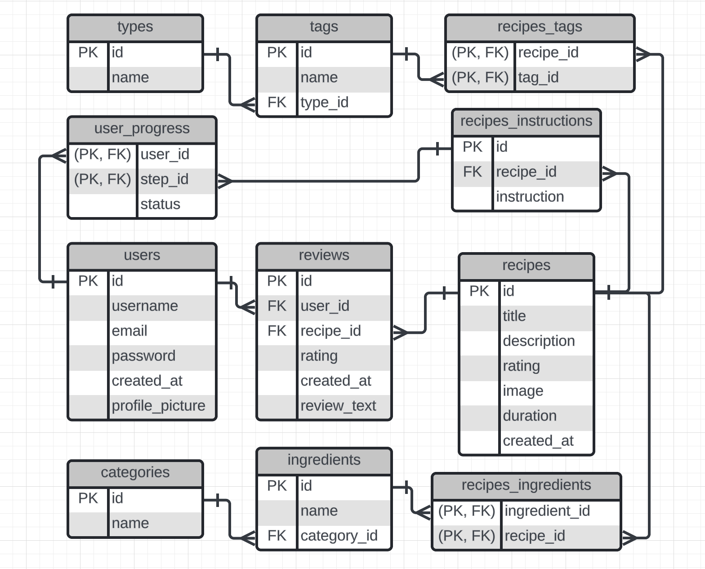

# Ning's Kitchen
Discover and explore personalized recipes tailored to your taste!

## Table of Contents

- [Project Overview](#project-overview)
- [Disclaimer](#disclaimer)
- [Features](#features)
- [Database Schema](#database-schema)
- [Installation](#installation)
- [Key Dependencies](#key-dependencies)
- [Usage](#usage)

## Project Overview

**Ning's Kitchen** is a responsive recipe website designed to provide users with a seamless and engaging experience in discovering and managing recipes. The application is built with a Java Spring Boot backend and a PostgreSQL database utilizing PL/pgSQL for stored procedures and functions, ensuring robust data management. The frontend is developed using React and TypeScript, offering a modern and interactive user experience.
Further development is underway to enhance the website's functionality and user experience, with plans to introduce more features and improvements.

## Disclaimer

This project is currently under active development and is part of my personal portfolio. It is intended to showcase my skills in fullstack development. Please note:
- This project is not suitable for production use due to its experimental nature and ongoing development. 
- It is intended for demonstration purposes only.
- Features are being actively added and refined.

## Features

- **Recipe Display** _(Implemented)_: Features a homepage with sections for "Today’s Recipes" and "Newest Recipes," providing users with fresh and relevant content.
- **Dynamic Navigation System** _(Implemented)_: Allows users to filter recipes using multi-select dropdown menus, with support for dietary restrictions, meal types, cuisines, and more, all managed through URL-based state management.
- **Upcoming Feature** _(Ongoing)_: Placeholder

## Database Schema
The following diagram illustrates the structure of my database:




## Installation

Follow these steps to set up the project locally on your machine.

### Prerequisites

Ensure you have the following software installed on your system:

- **Node.js**: [Download and install Node.js](https://nodejs.org/).
- **npm**: Comes with Node.js, but ensure it's up to date by running `npm install -g npm`.
- **Java Development Kit (JDK)**: [Download and install JDK](https://www.oracle.com/java/technologies/javase-jdk11-downloads.html) (version 21).
- **Maven**: [Download and install Maven](https://maven.apache.org/install.html).
- **PostgreSQL**: [Download and install PostgreSQL](https://www.postgresql.org/download/) and ensure the server is running.

### Clone the Repository

Clone the project repository from GitHub:

```bash
git clone https://github.com/ning-2021/Ning-s-Kitchen.git
cd Ning-s-Kitchen
```
## Key Dependencies

This project uses several important libraries and tools to deliver its functionality across both the backend and frontend components.

### Backend

- **Spring Boot**: Provides the backend framework for building and running the server-side application.
- **PostgreSQL**: Serves as the primary database for storing and managing application data.

### Frontend

- **React**: A JavaScript library for building user interfaces, used for the frontend of the application.
- **React Router**: Manages navigation and routing in the React application.
- **Axios**: Handles HTTP requests to the backend API.

### Development Tools

- **TypeScript**: Adds static typing to JavaScript, improving code quality and developer experience.
- **Webpack**: Bundles JavaScript files for usage in a browser, along with various plugins for optimization.
- **Babel**: Transpiles modern JavaScript and TypeScript into versions compatible with older browsers.

These dependencies are managed through `package.json` for the frontend and `pom.xml` for the backend, ensuring a consistent and reproducible development environment.

## Usage

This project includes several npm scripts to help with development, building, and maintenance tasks. Below is a description of each script and how to use them.

### Scripts

- **Frontend Development**:
    - **Command**: `npm run frontend`
    - **Description**: Starts the webpack development server using the configuration specified in `webpack.config.ts` with development mode enabled. This is useful for working on the frontend part of the application, allowing you to see changes in real-time as you develop.

- **Backend Development**:
    - **Command**: `npm run backend`
    - **Description**: Runs the Spring Boot application using Maven. This script is used for developing and testing the backend services of the application.

- **Concurrent Development**:
    - **Command**: `npm run dev`
    - **Description**: Utilizes the `concurrently` package to run both the frontend and backend development servers simultaneously. This setup is ideal for full-stack development, enabling you to work on both the frontend and backend at the same time.

- **Build**:
    - **Command**: `npm run build`
    - **Description**: Compiles the project using webpack. This script is typically used to prepare the application for production deployment by bundling and optimizing the frontend assets.

- **Clean Install**:
    - **Command**: `npm run clean-install`
    - **Description**: Removes the `node_modules` directory and `package-lock.json` file, then reinstalls all dependencies. This is useful for ensuring a clean setup, especially if you encounter issues with dependencies or need to reset your environment.

- **Clean**:
    - **Command**: `npm run clean`
    - **Description**: Runs `npm prune` to remove extraneous packages from the `node_modules` directory. This helps keep your project tidy by ensuring only the necessary packages are installed.
